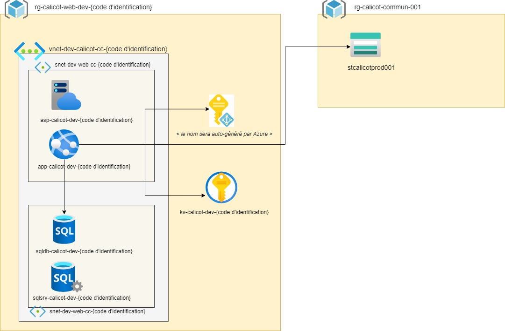

# Défi Interuniversitaire en **Infrastructure as Code (IaC)** - Microsoft Azure

**Durée** : 3 heures  
**Équipes** : 2 personnes  
**Date** : À METTRE

## Mise en situation

**Calicot**, une enseigne de vêtements, a récemment mis en place un site web marchand en réponse aux défis posés par la pandémie. Ce site a été conçu et déployé sur **Azure**. Cependant, sans infrastructure informatique préexistante, l'entreprise a configuré manuellement l'infrastructure via le portail Azure.

Avec le succès rapide du site, de nouveaux investisseurs ont rejoint l’entreprise. Ils ont rapidement remarqué l'absence d'automatisation dans le provisionnement de l’infrastructure, favorisant ainsi des erreurs lors des mises à jour ou de la création de nouveaux environnements (développement, acceptation, production).

Calicot fait appel à vous pour l’accompagner dans l’adoption de l’**Infrastructure as Code (IaC)**.

Votre mission est de créer les scripts nécessaires pour automatiser le déploiement de l'infrastructure actuelle de Calicot. Vous devrez choisir entre les technologies suivantes pour accomplir cette tâche :

- **Bicep**
- **Terraform**

Ces technologies ont été sélectionnées afin de faciliter le recrutement de talents pour soutenir la croissance de l'entreprise.

## Objectif du challenge

L'objectif est d'accompagner **Calicot** dans l’automatisation et l’optimisation de son infrastructure cloud sur **Azure** en utilisant l’**Infrastructure as Code (IaC)** et un pipeline **CI/CD** automatisé. Vous devrez déployer une infrastructure qui héberge l'**application web marchande** de Calicot, qui interagit avec une base de données **Azure SQL**. De plus, vous intégrerez un **Azure Blob Storage** existant et fourni par Calicot et qui contiendra les images des produits présentés par l'application web. La sécurité des données et des secrets, tels que la chaîne de connexion à la base de données, devra être gérée via **Azure Key Vault**.

Le diagramme de l'infrastructure Azure visée est le suivant :

💡 Calicot dispose déjà d'une équipe de développement dédiée à la mise à jour de son site web, vous n’avez donc qu’à vous concentrer sur la partie `Infrastructure as Code` (IaC) du projet.

## Tâches à réaliser

Pour débuter, faites un *fork* du référentiel <https://github.com/Cofomo/Beta-Test> et ajoutez les comptes **alexis35115** et **Belrarr** comme collaborateurs à votre référentiel.

💡 **Un groupe de ressources, un code d'identification et un `Service Principal` seront attribués à chaque équipe.**

Voici un aperçu des composants à mettre en place dans l'infrastructure :

### 1. **Provisionnement du réseau** :

- Créer un **Virtual Network (VNet)** nommé `vnet-dev-calicot-cc-{code d'identification}` avec deux sous-réseaux :
  - Un sous-réseau pour l'application web `snet-dev-web-cc-{code d'identification}` (**exposition publique autorisée**).
  - Un sous-réseau sécurisé pour la base de données `snet-dev-db-cc-{code d'identification}`.
  - **Région (location)** : Canada Central pour toutes ces ressources

### 2. **Déploiement de l'application web** :

- Déployer une application web sur un **Azure App Service** :
  - **Tier** : Standard S1
  - **Nom de la ressource** : `app-calicot-dev-{code d'identification}`
  - **Région (location)** : Canada Central
- Configurer l'**auto-scaling** de l'application pour gérer des montées en charge :
  - **Scale out method** : automatique
  - **Maximum burst** : 2 instances
  - **Always ready instance** : 1 instance
  - **Enforce scale out limit** : oui
  - **Maximum scale limit** : 2
- Forcer les communications via HTTPS uniquement.
- Prévenir la mise en veille (*Always on*).
- Notez qu'une application web sur Azure App Service requiert un Azure App Service Plan. Celui-ci devra être nommé `plan-calicot-dev-{code d'identification}`. 

### 3. **Création de la base de données** :

- Déployer une **Azure SQL Database** :
  - **Tier** : Basic
  - **Nom de la ressource** : `sqldb-calicot-dev-{code d'identification}`
  - **Région (location)** : Canada Central
- Limiter l'accès pour que seule l'application web puisse interagir avec la base de données en utilisant une **identité managée**.
- Attribuer les permissions requises à l'identité managée pour être en mesure de récupérer la chaîne de connexion dans la Key Vault.
- Notez qu'une Azure SQL Database requiert une instance Azure SQL Server. Celle-ci devra être nommée `sqlsrv-calicot-dev-{code d'identification}`. 

### 4. **Configuration de la Key Vault existante** :

- Alimenter **manuellement** le secret contenant la chaîne de connexion à la de base de données : 
- **Nom du Key Vault** : `kv-calicot-dev-{code d'identification}`
- **Nom du secret** : `ConnectionStrings`

### 5. **Automatisation via CI/CD** :

- Mettre en place un pipeline CI/CD avec **GitHub Actions** pour déployer l'infrastructure et automatiser la mise à jour de l'application.
  - Utiliser le **Service Principal** qui vous a été fourni pour l'authentification dans les workflows.
  - Les fichiers CI/CD doivent être placés sous `.github/workflows`.

#### Détails des workflows :

- **Déploiement de l'infrastructure** : (`iac.yml`)
  - Déclenchement **manuel**.
  - Doit inclure la création des ressources réseau, base de données, application web et storage account.
  - Ajoutez l'URL du compte de stockage nommé `st-calicot-prod-001` que Calicot met à votre disposition dans le fichier appsettings de l'App Service afin de permettre le référencement des images.

- **Compilation et déploiement de l'application web** : (`build-deploy.yml`)
  - Déclenchement lors d’un `push` sur la branche `main`.

- **Alimenter la base de données** : (`db.yml`)
  - Déclenchement **manuel**.
  - Utiliser le fichier `Auctions_Data.bacpac` qui se trouve dans le répertoire `db`.

### 6. **Prise en charge de plusieurs environnements** :

Calicot vous lance un nouveau défi : mettre en place un environnement d'acceptation (QA).

Votre mission sera d'extraire les valeurs des paramètres spécifiques à un environnement (comme les noms des ressources) dans un fichier dédié, puis d'adapter votre processus de déploiement pour utiliser le fichier de paramètres correspondant à chaque environnement.

Adaptez la nomenclature des ressources en substituant `dev` par `qa`.

⚠️ **Notes importantes** :

1. Le déploiement de l'environnement d'acceptation est déclenché automatiquement après un déploiement réussi en `dev`. Calicot vous demande également d’utiliser le même groupe de ressources afin de simplifier la gestion et réduire la charge de travail.
2. Les ressources de l'environnement QA doivent également être déployées dans la région (location) `Canada Central`.

## Critères d'évaluation

Votre projet sera évalué selon les critères suivants :

- **Automatisation** : Le pipeline CI/CD doit être entièrement fonctionnel pour un déploiement sans intervention manuelle.
- **Interaction de l'application** : L’application doit fonctionner correctement et afficher les informations attendues.
- **Sécurisation des secrets** : Les secrets doivent être stockés de manière sécurisée via **Azure Key Vault** et **GitHub Secrets**.
- **Respect des exigences** : Les ressources doivent respecter la nomenclature, le type et les configurations demandées.

## Conclusion

Ce défi vous permet de mettre en pratique les principes clés de l'automatisation, la sécurité et la scalabilité sur Azure. Il vous prépare à des scénarios réels en entreprise.
